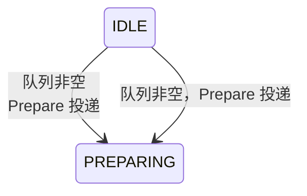

# Mermaid 渲染四大坑与根治方案（实战血泪）

含 Mermaid 图的页面前必读。这些都是真实踩过的坑，按严重程度排列。**结论先行：图在标签页/折叠容器里时，直接用"预渲染静态 SVG"方案，以下四个坑一次性全部绕开。**

## 目录

- 坑 1：stateDiagram-v2 过渡标签不支持 `<br/>`
- 坑 2：图文本里不能出现裸露的 `<` `>`
- 坑 3：startOnLoad 渲染隐藏容器 → translate(undefined, NaN)
- 坑 4：外部工具抓 `<pre class="mermaid">` 重渲染（最隐蔽）
- 根治方案：预渲染静态 SVG
- 渲染验证（写入后必做）

## 坑 1：`stateDiagram-v2` 的过渡标签不支持 `<br/>`

`flowchart` / `sequenceDiagram` 的文本里可以用 `<br/>` 换行，但 **`stateDiagram-v2` 不行**（mermaid 10.x 下直接报 `Syntax error in text`）。



> 注：mermaid 11.x 解析更宽松，`<br/>` 能过 parse；但为了兼容 10.x，一律不用。

## 坑 2：图文本里不能出现裸露的 `<` `>`（含转义实体）

`pre` 里的 `&lt;` 会被浏览器解码成 `<`，mermaid 时序解析器把 `<` 当箭头语法起点 → `Syntax error in text`。**mermaid 文本里永远不要出现尖括号**：

```
E->>E: subCommandId = E&lt;seq&gt;L&lt;行&gt;D&lt;域&gt;   ❌ 浏览器解码后 < 触发箭头解析
E->>E: subCommandId = E[seq]L[行]D[域]                 ✅ 用方括号
```

## 坑 3：`startOnLoad` 会渲染隐藏容器里的图 → `translate(undefined, NaN)`

`startOnLoad:true` 在页面加载时同时渲染**所有**图。放在 `x-show` 标签页里（初始隐藏 → `display:none`）的图，容器尺寸为 0，布局全部算出 NaN，控制台刷屏 `Error: <g> attribute transform: Expected number, "translate(undefined, NaN)"`。

运行时方案必须改懒渲染：`startOnLoad:false` + 切到哪个标签页才渲染哪个图：

```html
<main x-data="{
  tab:'overview',
  init(){ this.$nextTick(()=>this.renderMermaid()); },
  setTab(t){ this.tab=t; this.$nextTick(()=>this.renderMermaid()); },
  renderMermaid(){
    const panel = this.$refs[this.tab+'Panel'];
    if(!panel) return;
    const pres = panel.querySelectorAll('pre.mermaid:not([data-mmd-rendered])');
    if(!pres.length) return;
    mermaid.run({ nodes:[...pres], suppressErrors:true }).then(()=>{
      pres.forEach(p=>p.setAttribute('data-mmd-rendered','1'));
    });
  }
}">
  <!-- 每个标签内容 div 加 x-ref：<div x-show x-cloak x-ref="overviewPanel"> -->
</main>
```

## 坑 4：外部工具会抓 `<pre class="mermaid">` 用自己的 mermaid 重渲染（最隐蔽）

用户可能用带 mermaid 注入的工具打开页面（如 VS Code Markdown 预览的 `markdown-mermaid.js`，自带 mermaid 11.x）。它会：
1. 抓走页面里所有 `<pre class="mermaid">`，用自己的版本渲染（版本与页面 CDN 不一致 → 行为冲突）；
2. 与页面自带的 CDN mermaid 并存 → 双重渲染、连锁 NaN / 语法错误。

**根治方案：预渲染静态 SVG，移除全部运行时 mermaid。**

## 根治方案：预渲染静态 SVG

1. 生成 SVG（需真实浏览器，jsdom 无布局会失败）：
   ```bash
   mkdir -p /tmp/mmd-svg && cd /tmp/mmd-svg
   npm init -y && npm install mermaid@10.9.8 puppeteer-core
   # chrome-for-testing 从 npmmirror 镜像下载（googleapis 常被墙）：
   curl -sL -o chrome.zip "https://cdn.npmmirror.com/binaries/chrome-for-testing/120.0.6099.0/linux64/chrome-linux64.zip"
   unzip -q -o chrome.zip -d chrome && chmod -R +x chrome/chrome-linux64/
   ```
   ```js
   // gen_svgs.js：读取 HTML 里的 <pre class="mermaid">，逐个渲染成 .svg 文件
   const puppeteer = require('puppeteer-core');
   const fs = require('fs');
   const CHROME = '/tmp/mmd-svg/chrome/chrome-linux64/chrome';
   const MERMAID_JS = '/tmp/mmd-svg/node_modules/mermaid/dist/mermaid.min.js';
   const decode = s => s.replace(/&lt;/g,'<').replace(/&gt;/g,'>').replace(/&amp;/g,'&');
   (async () => {
     const browser = await puppeteer.launch({ executablePath: CHROME, args:['--no-sandbox'] });
     const page = await browser.newPage();
     await page.goto('about:blank', { waitUntil:'domcontentloaded' });
     await page.addScriptTag({ path: MERMAID_JS });
     await page.evaluate(() => mermaid.initialize({ startOnLoad:false, theme:'neutral', securityLevel:'loose' }));
     const html = fs.readFileSync('你的.html','utf8');
     const blocks = [...html.matchAll(/<pre class="mermaid">\n?([\s\S]*?)<\/pre>/g)].map(m=>m[1].trim());
     for (let i=0;i<blocks.length;i++){
       const text = decode(blocks[i]);
       const svg = await page.evaluate(async t => {
         const id = 'mmd' + Math.random().toString(36).slice(2);
         return (await mermaid.mermaidAPI.render(id, t)).svg;
       }, text);
       fs.writeFileSync(`diagram_${i+1}.svg`, svg);
     }
     await browser.close();
   })();
   ```
2. 替换 HTML（脚本化，SVG 体积大不要手贴）：
   - `<pre class="mermaid">…</pre>` → `<div class="mmd-svg">…svg…</div>`（**类名避开 `mermaid`**，外部工具抓不到）；
   - 删除 mermaid CDN `<script>` 与 `mermaid.initialize`；
   - 删除 Alpine 懒渲染逻辑（`renderMermaid` 等），标签切换只改 `tab`；
   - CSS：`.mmd-svg{overflow-x:auto}.mmd-svg svg{max-width:100%;height:auto}`。
3. 附带收益：离线可用、无版本冲突、任何工具都不会再碰这些图。

> 判断用哪个方案：**只在本机浏览器/无外部工具的预览环境** → 运行时 mermaid + 懒渲染 + 锁版本即可；**可能被其他工具打开/离线/公司内网** → 直接静态 SVG，一劳永逸。

## 渲染验证（写入后必做）

- 语法校验（node + jsdom 只能查 parse，**查不出布局 NaN**）：
  ```bash
  npm install mermaid@10.9.8 jsdom
  node -e "const {JSDOM}=require('jsdom'); const d=new JSDOM('<body>'); global.window=d.window; global.document=d.window.document; global.navigator=d.window.navigator; global.DOMPurify=d.window.DOMPurify; const m=require('mermaid').default; m.initialize({startOnLoad:false}); m.mermaidAPI.parse(process.argv[1]).then(()=>console.log('OK')).catch(e=>{console.error('FAIL',e.message.slice(0,300));process.exit(1)});" '你的图文本'"
  ```
- **布局/NaN 必须用真实浏览器验证**（jsdom 无 getBBox 布局）：puppeteer-core + chrome-for-testing（下载命令见坑 4），逐标签点击后检查：
  ```js
  // SVG 元素没有 offsetWidth！可见性用 getBoundingClientRect
  [...document.querySelectorAll('.mmd-svg svg')].filter(s=>s.getBoundingClientRect().width>0)
  // NaN 检查：/translate\(undefined,\s*NaN\)/.test(svg.innerHTML)
  ```
- 控制台必须 0 错误（监听 `console` 与 `pageerror` 事件）。
- 迭代场景下每次重新生成后，还要点开"迭代记录"标签页确认面板正常渲染。
