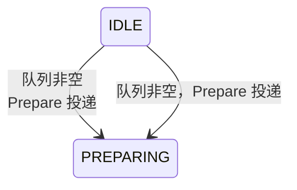

## 产出物

一个完全自包含的 HTML 文件：
- 无需服务器，浏览器直接打开
- 所有库走 CDN，数据内嵌
- 支持点击展开、标签切换、悬停提示等交互
- 中文字符正确渲染（UTF-8）

---

## ⭐ 最高优先级：用普通话改写，不要抄原文

这是本 skill 最重要的原则。原文是写给领域专家的，充斥着行话缩写；**你的任务是翻译给初次接触这个方向的人看**。

### 改写原则

**每一条内容都要问自己**：*"一个聪明但不了解这个项目的人，读完能明白这在说什么吗？"*
如果不能，就改写。不要因为"忠于原文"而保留读者看不懂的内容。

**三种处理方式**（按优先级）：

1. **直接替换**：能用大白话说清楚的，直接改写，删掉原始术语
   > ❌ `vol正向预测收益、守卫/择时/regime降仓/vol-targeting四者同因失败`
   > ✅ `过去试过四种减少亏损的方法：自动止损、择时操作、仓位控制、波动率调仓——测试下来全部在同一个地方失败：市场最低迷时把股票卖掉了`

2. **注释保留**：专业术语不可避免时，在括号内补充一句大白话解释
   > ❌ `ETL建成后M1附带行动项验证`
   > ✅ `数据管道（ETL）搭好后，顺手验证这个猜想`

3. **术语悬浮提示**：必须保留的专业词汇，用 tooltip 包裹，鼠标悬停显示解释
   ```html
   <span class="tooltip-term" title="从多个原始 CSV 文件读取、清洗、统一格式后写入 parquet">ETL</span>
   ```
   在 `<style>` 中添加：
   ```css
   .tooltip-term {
     border-bottom: 1px dashed #94a3b8;
     cursor: help;
     color: #475569;
   }
   ```

### 常见行话翻译参考

| 原文术语 | 改写建议 |
|---|---|
| ETL / parquet | 数据处理管道 / 列式存储文件 |
| regime | 市场状态（牛市/熊市/震荡等） |
| vol / volatility | 价格波动幅度 |
| lag=N 交易日 | 数据延迟 N 个交易日才能用 |
| generation | 一次完整的数据构建结果 |
| fingerprint / 指纹 | 文件哈希校验值（用于检测数据是否被篡改） |
| sentinel / 哨兵 | 自动检测异常的守卫程序 |
| GC 保护 | 防止被自动清理 |
| 前视 / look-ahead | 回测时不小心用到了未来的数据（作弊） |
| 幸存者偏差 | 已退市的失败股票不在数据里，导致结论过于乐观 |
| prereg | 预注册（先写下判断标准，再去看数据，防止事后挑指标） |

### 两层内容模式

每张卡片/条目用"摘要 + 可选技术详情"的两层结构：

```html
<!-- 先说人话，再说技术细节 -->
<div class="border rounded-xl p-4">
  <p class="font-semibold">一句话说清楚这是什么</p>
  <p class="text-sm text-gray-600 mt-1">用普通话解释为什么重要、会发生什么</p>
  <details class="mt-3">
    <summary class="text-xs text-gray-400 cursor-pointer hover:text-gray-600">原始技术细节 ▾</summary>
    <p class="text-xs text-gray-500 mt-1"><!-- 原文摘录或更详细的技术说明 --></p>
  </details>
</div>
```

---

## 第一步：结构分析

读取文档后，识别以下结构元素并记录数量与内容：

| 元素类型 | 识别特征 | → 可视化形式 |
|---|---|---|
| 里程碑/阶段 | M0~Mn、Phase N、阶段 | 带可展开任务的路线图卡片 |
| 嵌套任务树 | Mx-Sy-Tz、子任务列表 | 可折叠树（三级） |
| 硬性约束/红线 | 红线、禁止、MUST NOT、冻结条款 | 红色警告卡 + 图标 |
| 假设/实验 | H1~Hn、待验证假设 | 状态徽章卡片 |
| 架构分层 | 四层、Layer、数据层/指标层/… | 层叠堆栈图 |
| 依赖关系 | blocks/blockedBy、前置条件 | Mermaid 流程图 |
| 数据事实表 | markdown 表格、事实摘要 | 可排序交互表 |
| 实现陷阱 | 雷区、Rn、注意点 | 折叠警告列表 |
| 关键决策 | 冻结口径、已确认设计 | 决策卡片网格 |

提取元数据：文档标题、一句话摘要、日期、核心数字（几个里程碑、几条红线…）。

---

## 第二步：页面结构设计

按内容决定标签数量，没有对应内容的标签不生成：

1. **概览 (Overview)**：标题卡、关键统计数字、架构层叠图、里程碑依赖关系图（Mermaid）
2. **路线图 (Roadmap)**：M0→Mn 可展开卡片 → 展开见切片 → 展开见任务
3. **约束与决策 (Rules)**：红线警告卡（全部展示，不折叠）、冻结决策列表
4. **假设追踪 (Hypotheses)**：Hn 卡片网格，含期望结论和触发条件
5. **实现指南 (Guide)**：雷区列表、关键锚点表、技术注意事项
6. **数据事实 (Data)**：文档中的数据表格、画像数字等

---

## 第三步：生成 HTML

### 技术栈（全 CDN，零安装）

```html
<script src="https://cdn.tailwindcss.com"></script>
<script defer src="https://cdn.jsdelivr.net/npm/alpinejs@3.14.1/dist/cdn.min.js"></script>
<script src="https://cdn.jsdelivr.net/npm/mermaid@10.9.8/dist/mermaid.min.js"></script>
```

> ⚠️ **mermaid 必须锁定精确版本**（如 `@10.9.8`），不要用 `@10` 这种不锁版本的写法——不同工具注入的 mermaid 版本不同，行为差异极大（见下文"渲染坑"）。
>
> ⚠️ **如果图放在标签页 / 折叠容器里，推荐直接采用"预渲染静态 SVG"方案**（见下文"渲染坑与根治"），彻底移除运行时 mermaid 依赖，任何环境都不会再报错。

### 颜色语义系统

| 用途 | Tailwind 类 |
|---|---|
| 红线 / 阻断 / 禁止 | `border-red-500 bg-red-50 text-red-800` |
| 警告 / 待处理 | `border-amber-500 bg-amber-50 text-amber-800` |
| 通过 / 已确认 | `border-emerald-500 bg-emerald-50 text-emerald-800` |
| 架构 / 数据 | `border-blue-500 bg-blue-50 text-blue-800` |
| 策略 / 决策 | `border-purple-500 bg-purple-50 text-purple-800` |
| 里程碑主色 | `bg-slate-800 text-white` |

### 核心组件模式

**里程碑可展开卡片**
```html
<div x-data="{open:false}" class="border rounded-xl overflow-hidden">
  <button @click="open=!open"
    class="w-full flex items-center gap-3 p-4 bg-slate-800 text-white hover:bg-slate-700">
    <span class="font-mono bg-white/20 px-2 py-0.5 rounded text-sm">M1</span>
    <span class="font-semibold">统一 ETL</span>
    <span class="ml-auto text-xs opacity-70">5 切片 · 22 任务</span>
    <svg class="w-4 h-4 transition-transform" :class="open&&'rotate-180'"
      fill="none" viewBox="0 0 24 24" stroke="currentColor">
      <path stroke-linecap="round" stroke-linejoin="round" stroke-width="2" d="M19 9l-7 7-7-7"/>
    </svg>
  </button>
  <div x-show="open" x-collapse class="p-4 space-y-2 bg-slate-50">
    <!-- 切片列表 -->
  </div>
</div>
```
> 注：`x-collapse` 需要 Alpine.js Collapse 插件。若不可用，改用 `x-show="open"` 加 `class="transition-all"`。

**红线警告卡**
```html
<div class="border-l-4 border-red-500 bg-red-50 rounded-r-lg p-4">
  <div class="flex items-start gap-3">
    <span class="text-red-500 text-xl mt-0.5">🚫</span>
    <div>
      <p class="font-semibold text-red-800">红线 1：不产生降仓规则</p>
      <p class="mt-1 text-sm text-red-700">vol 正向预测收益，守卫/择时/regime 降仓四者同因失败已定论。</p>
    </div>
  </div>
</div>
```

**假设状态卡**
```html
<div class="border rounded-xl p-4 hover:shadow-md transition-shadow">
  <div class="flex items-center justify-between mb-2">
    <span class="font-mono font-bold text-lg">H1</span>
    <span class="text-xs px-2 py-1 rounded-full bg-amber-100 text-amber-800 font-medium">待验证</span>
  </div>
  <p class="font-medium text-sm mb-1">镜重圆回撤归因</p>
  <p class="text-xs text-gray-600">事件前窗暴露分位中位数 ≥P80 且 KS p&lt;0.05 → 成立</p>
  <div class="mt-2 pt-2 border-t text-xs text-gray-500">预期结论：M3 实跑后判决</div>
</div>
```

**架构层叠图**
```html
<div class="space-y-1 max-w-lg">
  <div class="bg-purple-100 border-2 border-purple-300 rounded-lg p-3 text-center font-medium">
    策略链路层 · concept_exposure / env_report / 审计钩子
  </div>
  <div class="bg-blue-100 border-2 border-blue-300 rounded-lg p-3 text-center font-medium mx-4">
    观测层 · builder concept 阶段 / reporter / webui
  </div>
  <div class="bg-green-100 border-2 border-green-300 rounded-lg p-3 text-center font-medium mx-8">
    指标层 · market panel / stock heat_rank_pct / lifecycle
  </div>
  <div class="bg-gray-100 border-2 border-gray-300 rounded-lg p-3 text-center font-medium mx-12">
    数据层 · concept_etl / parquet / 三哨兵 / 指纹缓存
  </div>
  <div class="text-center text-xs text-gray-400 mt-1">↑ 每层只读下一层，禁止反向依赖</div>
</div>
```

**Mermaid 依赖图**（说明：这是图的**源文本**；最终 HTML 里把它预渲染成静态 SVG 内嵌，见"渲染坑与根治"，不要保留 `<pre class="mermaid">`）
```html
<div class="overflow-x-auto">
<pre class="mermaid">
graph LR
  M0[M0 前置实验\nP0+P1] --> M2
  M1[M1 统一ETL] --> M2[M2 观测层]
  M2 --> M3[M3 策略链路]
  M3 --> M4[M4 审计仓管]
  M5[M5 二期\n独立预注册]
  style M0 fill:#fef3c7
  style M5 fill:#f3f4f6,stroke-dasharray:5
</pre>
</div>
```

**雷区折叠列表**
```html
<div x-data="{open:false}">
  <button @click="open=!open"
    class="flex items-center gap-2 text-amber-800 font-semibold hover:text-amber-600">
    <span>⚠️ R1 — OPTIONAL 门禁嵌在 leverage.enabled 下</span>
    <span x-text="open?'▲':'▼'" class="text-xs"></span>
  </button>
  <div x-show="open" class="mt-2 text-sm text-gray-700 pl-6 border-l-2 border-amber-300">
    <p><strong>位置：</strong> builder.py:198-207</p>
    <p><strong>规避：</strong> concept 必须独立 config.concept.enabled 条件块</p>
  </div>
</div>
```

**标签页导航**
```html
<div x-data="{tab:'overview'}">
  <!-- 标签按钮 -->
  <div class="flex gap-1 border-b mb-6 overflow-x-auto">
    <button @click="tab='overview'"
      :class="tab==='overview'?'border-b-2 border-blue-600 text-blue-600':'text-gray-600'"
      class="px-4 py-2 text-sm font-medium whitespace-nowrap">概览</button>
    <!-- 其余标签... -->
  </div>
  <!-- 各标签内容 -->
  <div x-show="tab==='overview'">...</div>
</div>
```

---

## ⚠️ Mermaid 渲染四大坑与根治方案（实战血泪）

这些都是真实踩过的坑，按严重程度排列。**结论先行：图在标签页/折叠容器里时，直接用"预渲染静态 SVG"方案，以下四个坑一次性全部绕开。**

### 坑 1：`stateDiagram-v2` 的过渡标签不支持 `<br/>`

`flowchart` / `sequenceDiagram` 的文本里可以用 `<br/>` 换行，但 **`stateDiagram-v2` 不行**（mermaid 10.x 下直接报 `Syntax error in text`）。



> 注：mermaid 11.x 解析更宽松，`<br/>` 能过 parse；但为了兼容 10.x，一律不用。

### 坑 2：图文本里不能出现裸露的 `<` `>`（含转义实体）

`pre` 里的 `&lt;` 会被浏览器解码成 `<`，mermaid 时序解析器把 `<` 当箭头语法起点 → `Syntax error in text`。**mermaid 文本里永远不要出现尖括号**：

```
E->>E: subCommandId = E&lt;seq&gt;L&lt;行&gt;D&lt;域&gt;   ❌ 浏览器解码后 < 触发箭头解析
E->>E: subCommandId = E[seq]L[行]D[域]                 ✅ 用方括号
```

### 坑 3：`startOnLoad` 会渲染隐藏容器里的图 → `translate(undefined, NaN)`

`startOnLoad:true` 在页面加载时同时渲染**所有**图。放在 `x-show` 标签页里（初始隐藏 → `display:none`）的图，容器尺寸为 0，布局全部算出 NaN，控制台刷屏 `Error: <g> attribute transform: Expected number, "translate(undefined, NaN)"`。

运行时方案必须改懒渲染：`startOnLoad:false` + 切到哪个标签页才渲染哪个图：

```html
<main x-data="{
  tab:'overview',
  init(){ this.$nextTick(()=>this.renderMermaid()); },
  setTab(t){ this.tab=t; this.$nextTick(()=>this.renderMermaid()); },
  renderMermaid(){
    const panel = this.$refs[this.tab+'Panel'];
    if(!panel) return;
    const pres = panel.querySelectorAll('pre.mermaid:not([data-mmd-rendered])');
    if(!pres.length) return;
    mermaid.run({ nodes:[...pres], suppressErrors:true }).then(()=>{
      pres.forEach(p=>p.setAttribute('data-mmd-rendered','1'));
    });
  }
}">
  <!-- 每个标签内容 div 加 x-ref：<div x-show x-cloak x-ref="overviewPanel"> -->
</main>
```

### 坑 4：外部工具会抓 `<pre class="mermaid">` 用自己的 mermaid 重渲染（最隐蔽）

用户可能用带 mermaid 注入的工具打开页面（如 VS Code Markdown 预览的 `markdown-mermaid.js`，自带 mermaid 11.x）。它会：
1. 抓走页面里所有 `<pre class="mermaid">`，用自己的版本渲染（版本与页面 CDN 不一致 → 行为冲突）；
2. 与页面自带的 CDN mermaid 并存 → 双重渲染、连锁 NaN / 语法错误。

**根治方案：预渲染静态 SVG，移除全部运行时 mermaid。**

1. 生成 SVG（需真实浏览器，jsdom 无布局会失败）：
   ```bash
   mkdir -p /tmp/mmd-svg && cd /tmp/mmd-svg
   npm init -y && npm install mermaid@10.9.8 puppeteer-core
   # chrome-for-testing 从 npmmirror 镜像下载（googleapis 常被墙）：
   curl -sL -o chrome.zip "https://cdn.npmmirror.com/binaries/chrome-for-testing/120.0.6099.0/linux64/chrome-linux64.zip"
   unzip -q -o chrome.zip -d chrome && chmod -R +x chrome/chrome-linux64/
   ```
   ```js
   // gen_svgs.js：读取 HTML 里的 <pre class="mermaid">，逐个渲染成 .svg 文件
   const puppeteer = require('puppeteer-core');
   const fs = require('fs');
   const CHROME = '/tmp/mmd-svg/chrome/chrome-linux64/chrome';
   const MERMAID_JS = '/tmp/mmd-svg/node_modules/mermaid/dist/mermaid.min.js';
   const decode = s => s.replace(/&lt;/g,'<').replace(/&gt;/g,'>').replace(/&amp;/g,'&');
   (async () => {
     const browser = await puppeteer.launch({ executablePath: CHROME, args:['--no-sandbox'] });
     const page = await browser.newPage();
     await page.goto('about:blank', { waitUntil:'domcontentloaded' });
     await page.addScriptTag({ path: MERMAID_JS });
     await page.evaluate(() => mermaid.initialize({ startOnLoad:false, theme:'neutral', securityLevel:'loose' }));
     const html = fs.readFileSync('你的.html','utf8');
     const blocks = [...html.matchAll(/<pre class="mermaid">\n?([\s\S]*?)<\/pre>/g)].map(m=>m[1].trim());
     for (let i=0;i<blocks.length;i++){
       const text = decode(blocks[i]);
       const svg = await page.evaluate(async t => {
         const id = 'mmd' + Math.random().toString(36).slice(2);
         return (await mermaid.mermaidAPI.render(id, t)).svg;
       }, text);
       fs.writeFileSync(`diagram_${i+1}.svg`, svg);
     }
     await browser.close();
   })();
   ```
2. 替换 HTML（脚本化，SVG 体积大不要手贴）：
   - `<pre class="mermaid">…</pre>` → `<div class="mmd-svg">…svg…</div>`（**类名避开 `mermaid`**，外部工具抓不到）；
   - 删除 mermaid CDN `<script>` 与 `mermaid.initialize`；
   - 删除 Alpine 懒渲染逻辑（`renderMermaid` 等），标签切换只改 `tab`；
   - CSS：`.mmd-svg{overflow-x:auto}.mmd-svg svg{max-width:100%;height:auto}`。
3. 附带收益：离线可用、无版本冲突、任何工具都不会再碰这些图。

> 判断用哪个方案：**只在本机浏览器/无外部工具的预览环境** → 运行时 mermaid + 懒渲染 + 锁版本即可；**可能被其他工具打开/离线/公司内网** → 直接静态 SVG，一劳永逸。

---

## 第四步：输出文件

1. **写入路径**：默认输出到**当前项目文件夹**（即当前工作目录）下的 `.doc-visualizer-output/` 目录：
   ```bash
   mkdir -p .doc-visualizer-output
   ```
   输出文件：`.doc-visualizer-output/<filename>.html`
   > 默认一律使用当前工作目录下的 `.doc-visualizer-output/`；仅当用户明确指定了其他输出路径时，遵循用户指定。

2. **文件名规则**：`<文档日期>_<文档主题简称>.html`，例如 `2026-08-08_概念数据接入.html`

3. **打开文件**（WSL/Linux 优先 xdg-open，若失败提示路径）：
   ```bash
   xdg-open .doc-visualizer-output/xxx.html 2>/dev/null || \
   explorer.exe "$(wslpath -w "$(pwd)/.doc-visualizer-output/xxx.html")" 2>/dev/null || \
   echo "请在浏览器中打开: $(pwd)/.doc-visualizer-output/xxx.html"
   ```

4. 告知用户文件路径（绝对路径）。

---

## 生成质量检查清单

在写入文件前，心智扫描以下问题：

- [ ] `charset="UTF-8"` 在 `<head>` 首行
- [ ] 所有 CDN script 标签正确，Alpine.js 有 `defer`
- [ ] Alpine.js `x-data` 在需要状态的**父容器**上，不是子元素上
- [ ] Mermaid CDN 版本已**锁定精确版本**（如 `@10.9.8`），没有 `@10` 这种漂移写法
- [ ] Mermaid 图文本中无裸露 `<` `>`（含 `&lt;` `&gt;` 实体，会被浏览器解码后触发箭头解析）
- [ ] `stateDiagram-v2` 的过渡标签无 `<br/>`
- [ ] 标签页/折叠容器里的图：要么静态 SVG，要么 `startOnLoad:false` + 切标签懒渲染
- [ ] 若用静态 SVG：`<div>` 类名不含 `mermaid`，页面无任何运行时 mermaid 引用
- [ ] 标签页的 `x-show` 对应 `tab==='xxx'` 字符串精确匹配
- [ ] 文档中的 `<` `>` `&` 在 HTML 文本节点中已转义为 `&lt;` `&gt;` `&amp;`
- [ ] 移动端友好（使用 `sm:` `md:` 响应式前缀或 `overflow-x-auto`）
- [ ] 所有中文内容正确保留，无截断

### 渲染验证（写入后必做）

- 语法校验（node + jsdom 只能查 parse，**查不出布局 NaN**）：
  ```bash
  npm install mermaid@10.9.8 jsdom
  node -e "const {JSDOM}=require('jsdom'); const d=new JSDOM('<body>'); global.window=d.window; global.document=d.window.document; global.navigator=d.window.navigator; global.DOMPurify=d.window.DOMPurify; const m=require('mermaid').default; m.initialize({startOnLoad:false}); m.mermaidAPI.parse(process.argv[1]).then(()=>console.log('OK')).catch(e=>{console.error('FAIL',e.message.slice(0,300));process.exit(1)});" '你的图文本'"
  ```
- **布局/NaN 必须用真实浏览器验证**（jsdom 无 getBBox 布局）：puppeteer-core + chrome-for-testing（下载命令见"坑 4"），逐标签点击后检查：
  ```js
  // SVG 元素没有 offsetWidth！可见性用 getBoundingClientRect
  [...document.querySelectorAll('.mmd-svg svg')].filter(s=>s.getBoundingClientRect().width>0)
  // NaN 检查：/translate\(undefined,\s*NaN\)/.test(svg.innerHTML)
  ```
- 控制台必须 0 错误（监听 `console` 与 `pageerror` 事件）。

---

## 页面整体 HTML 骨架

> 推荐：图用**预渲染静态 SVG**（见"渲染坑与根治"），骨架里没有任何 mermaid 运行时引用。
> 若坚持运行时 mermaid：加回锁版本的 CDN `<script>` + `mermaid.initialize({startOnLoad:false,...})`，并在 `<main>` 上加懒渲染逻辑（见"坑 3"）。

```html
<!DOCTYPE html>
<html lang="zh-CN">
<head>
  <meta charset="UTF-8">
  <meta name="viewport" content="width=device-width, initial-scale=1.0">
  <title><!-- 文档标题 --></title>
  <script src="https://cdn.tailwindcss.com"></script>
  <script defer src="https://cdn.jsdelivr.net/npm/alpinejs@3.14.1/dist/cdn.min.js"></script>
  <style>
    [x-cloak]{display:none!important}
    .tab-content{display:none}
    /* 静态 SVG 图：横向可滚动、等比缩放 */
    .mmd-svg{overflow-x:auto}
    .mmd-svg svg{max-width:100%;height:auto}
  </style>
</head>
<body class="bg-gray-50 text-gray-900 min-h-screen">

  <!-- 顶部 Hero -->
  <header class="bg-gradient-to-r from-slate-900 to-slate-700 text-white px-6 py-8">
    <div class="max-w-5xl mx-auto">
      <p class="text-slate-400 text-sm mb-1"><!-- 日期 --></p>
      <h1 class="text-2xl font-bold mb-2"><!-- 标题 --></h1>
      <p class="text-slate-300 max-w-2xl"><!-- 一句话摘要 --></p>
      <!-- 关键统计数字徽章 -->
      <div class="flex flex-wrap gap-2 mt-4">
        <span class="bg-white/10 rounded-full px-3 py-1 text-sm">5 条里程碑</span>
        <span class="bg-red-500/30 rounded-full px-3 py-1 text-sm">5 条红线</span>
        <span class="bg-amber-500/30 rounded-full px-3 py-1 text-sm">7 个假设</span>
      </div>
    </div>
  </header>

  <!-- 主内容 -->
  <main class="max-w-5xl mx-auto px-4 py-8" x-data="{tab:'overview'}">
    <!-- 标签导航 -->
    <div class="flex gap-1 border-b mb-6 overflow-x-auto">
      <button @click="tab='overview'"
        :class="tab==='overview'?'border-b-2 border-blue-600 text-blue-600':'text-gray-600'"
        class="px-4 py-2 text-sm font-medium whitespace-nowrap">概览</button>
      <!-- 其余标签... -->
    </div>
    <!-- 标签内容：图直接放静态 SVG -->
    <div x-show="tab==='overview'" x-cloak>
      <div class="overflow-x-auto bg-white border border-gray-200 rounded-xl p-4">
        <div class="mmd-svg"><!-- 此处为预渲染好的 <svg>...</svg> --></div>
      </div>
    </div>
  </main>

</body>
</html>
```

---

## 典型调用示例

- `把 market_observer/docs/2026-08-08_概念数据接入方案.md 做成交互式可视化`
- `帮我用图表理解这份设计文档`
- `将这两份方案文档合并成一个可视化仪表板`
- `make an interactive dashboard for this architecture doc`
- `visualize the milestone dependencies in this plan`
