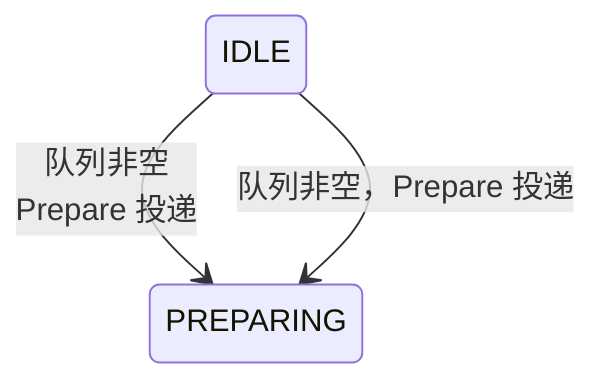

# Mermaid 渲染六大坑与根治方案（实战血泪）

> **先看这个**：若已按 `svg-authoring.md` 手写 SVG，**本文件可以整段跳过**。以下内容只在确实用了 mermaid 时才适用。

按严重程度排列。**结论先行：图在标签页/折叠容器里时，直接用"预渲染静态 SVG"方案，前四个坑一次性全部绕开（坑 5/坑 6 是静态 SVG 落地后的显示与维护问题，同样要按方案处理）。**

## 起点：依赖关系图的源文本

依赖/路线类图用 `graph LR`，里程碑用实色、未启动阶段用灰虚线：

```html
<div class="overflow-x-auto">
<pre class="mermaid">
graph LR
  M0[M0 前置实验\nP0+P1] --> M2
  M1[M1 统一ETL] --> M2[M2 观测层]
  M2 --> M3[M3 策略链路]
  M3 --> M4[M4 审计仓管]
  M5[M5 二期\n独立预注册]
  style M0 fill:#fef3c7
  style M5 fill:#f3f4f6,stroke-dasharray:5
</pre>
</div>
```

> 这是**源文本**；交付前必须按坑 4 把它预渲染成静态 SVG 内嵌，不要保留 `<pre class="mermaid">`。

## 坑 1：`stateDiagram-v2` 的过渡标签不支持 `<br/>`

`flowchart` / `sequenceDiagram` 的文本里可以用 `<br/>` 换行，但 **`stateDiagram-v2` 不行**（mermaid 10.x 下直接报 `Syntax error in text`）。



> 注：mermaid 11.x 解析更宽松，`<br/>` 能过 parse；但为了兼容 10.x，一律不用。

## 坑 2：图文本里不能出现裸露的 `<` `>`（含转义实体）

`pre` 里的 `&lt;` 会被浏览器解码成 `<`，mermaid 时序解析器把 `<` 当箭头语法起点 → `Syntax error in text`。**mermaid 文本里永远不要出现尖括号**：

```
E->>E: subCommandId = E&lt;seq&gt;L&lt;行&gt;D&lt;域&gt;   ❌ 浏览器解码后 < 触发箭头解析
E->>E: subCommandId = E[seq]L[行]D[域]                 ✅ 用方括号
```

## 坑 3：`startOnLoad` 会渲染隐藏容器里的图 → `translate(undefined, NaN)`

`startOnLoad:true` 在页面加载时同时渲染**所有**图。放在 `x-show` 标签页里（初始隐藏 → `display:none`）的图，容器尺寸为 0，布局全部算出 NaN，控制台刷屏 `Error: <g> attribute transform: Expected number, "translate(undefined, NaN)"`。

运行时方案必须改懒渲染：`startOnLoad:false` + 切到哪个标签页才渲染哪个图：

```html
<main x-data="{
  tab:'overview',
  init(){ this.$nextTick(()=>this.renderMermaid()); },
  setTab(t){ this.tab=t; this.$nextTick(()=>this.renderMermaid()); },
  renderMermaid(){
    const panel = this.$refs[this.tab+'Panel'];
    if(!panel) return;
    const pres = panel.querySelectorAll('pre.mermaid:not([data-mmd-rendered])');
    if(!pres.length) return;
    mermaid.run({ nodes:[...pres], suppressErrors:true }).then(()=>{
      pres.forEach(p=>p.setAttribute('data-mmd-rendered','1'));
    });
  }
}">
  <!-- 每个标签内容 div 加 x-ref：<div x-show x-cloak x-ref="overviewPanel"> -->
</main>
```

## 坑 4：外部工具会抓 `<pre class="mermaid">` 用自己的 mermaid 重渲染（最隐蔽）

用户可能用带 mermaid 注入的工具打开页面（如 VS Code Markdown 预览的 `markdown-mermaid.js`，自带 mermaid 11.x）。它会：

1. 抓走页面里所有 `<pre class="mermaid">`，用自己的版本渲染（版本与页面 CDN 不一致 → 行为冲突）；
2. 与页面自带的 CDN mermaid 并存 → 双重渲染、连锁 NaN / 语法错误。

**根治方案：预渲染静态 SVG，移除全部运行时 mermaid。**

1. 生成 SVG（需真实浏览器，jsdom 无布局会失败）：

   ```bash
   mkdir -p /tmp/mmd-svg && cd /tmp/mmd-svg
   npm init -y && npm install mermaid@10.9.8 puppeteer-core
   # chrome-for-testing 从 npmmirror 镜像下载（googleapis 常被墙）：
   curl -sL -o chrome.zip "https://cdn.npmmirror.com/binaries/chrome-for-testing/120.0.6099.0/linux64/chrome-linux64.zip"
   unzip -q -o chrome.zip -d chrome && chmod -R +x chrome/chrome-linux64/
   ```

   ```js
   // gen_svgs.js：读取 HTML 里的 <pre class="mermaid">，逐个渲染成 .svg 文件
   const puppeteer = require('puppeteer-core');
   const fs = require('fs');
   const CHROME = '/tmp/mmd-svg/chrome/chrome-linux64/chrome';
   const MERMAID_JS = '/tmp/mmd-svg/node_modules/mermaid/dist/mermaid.min.js';
   const decode = s => s.replace(/&lt;/g,'<').replace(/&gt;/g,'>').replace(/&amp;/g,'&');
   (async () => {
     const browser = await puppeteer.launch({ executablePath: CHROME, args:['--no-sandbox'] });
     const page = await browser.newPage();
     await page.goto('about:blank', { waitUntil:'domcontentloaded' });
     await page.addScriptTag({ path: MERMAID_JS });
     // 行高与宿主页（Tailwind preflight 1.5）对齐，防止标签框高按紧凑行高测量导致嵌页后裁切（见坑 5）
     await page.evaluate(() => { const s = document.createElement('style'); s.textContent = 'div{line-height:1.5}'; document.head.appendChild(s); });
     await page.evaluate(() => mermaid.initialize({ startOnLoad:false, theme:'neutral', securityLevel:'loose' }));
     const html = fs.readFileSync('你的.html','utf8');
     const blocks = [...html.matchAll(/<pre class="mermaid">\n?([\s\S]*?)<\/pre>/g)].map(m=>m[1].trim());
     for (let i=0;i<blocks.length;i++){
       const text = decode(blocks[i]);
       const svg = await page.evaluate(async t => {
         const id = 'mmd' + Math.random().toString(36).slice(2);
         return (await mermaid.mermaidAPI.render(id, t)).svg;
       }, text);
       fs.writeFileSync(`diagram_${i+1}.svg`, svg);
     }
     await browser.close();
   })();
   ```

2. 替换 HTML（脚本化，SVG 体积大不要手贴）：
   - `<pre class="mermaid">…</pre>` → `<div class="svg-wrap">…svg…</div>`（**类名避开 `mermaid`**，外部工具抓不到）；
   - 删除 mermaid CDN `<script>` 与 `mermaid.initialize`；
   - 删除 Alpine 懒渲染逻辑（`renderMermaid` 等），标签切换只改 `tab`；
   - 根 svg 标签剥掉内联 `style="max-width:…"` / `width` / `height`，按 viewBox 宽度设显式 `width` 属性（见坑 6）；
   - CSS：`.svg-wrap{overflow-x:auto} .svg-wrap svg{max-width:none;height:auto} .svg-wrap foreignObject div{line-height:1.5}`（自然尺寸 + 横向滚动 + 行高锁定，见坑 5/坑 6）。

3. 附带收益：离线可用、无版本冲突、任何工具都不会再碰这些图。

> 判断用哪个方案：**只在本机浏览器/无外部工具的预览环境** → 运行时 mermaid + 懒渲染 + 锁版本即可；**可能被其他工具打开/离线/公司内网** → 直接静态 SVG，一劳永逸。

## 坑 5：宿主页 CSS 膨胀 SVG 内的 foreignObject 标签 → 多行文字被框底裁切（静态 SVG 也中招，最容易被漏检）

mermaid flowchart-v2 的节点标签是 `foreignObject` 里的 HTML div。`mermaidAPI.render` 按**当前渲染环境**的行高测量标签框高；干净渲染环境里生成的 SVG，内嵌进带 Tailwind 的宿主页后，preflight 的 `line-height:1.5` 会继承进标签 div —— 文字实际变高、超出按紧凑行高算出的框高，**多行节点的最后一行被框底裁掉**。生成时的截图（无 Tailwind）查不出来，缩放后的整页截图也容易看漏，用户拿到手才报"框太小、内容显示不全"。

**根治（生成时 + 宿主页两边锁定同一行高）：**

1. 生成 SVG 前，在渲染页注入与宿主一致的行高，让 mermaid 按真实行高测量框高（必须在 `mermaid.initialize` / `render` **之前**）：

   ```js
   await page.evaluate(() => {
     const s = document.createElement('style');
     s.textContent = 'div{line-height:1.5}';   // 与宿主页 Tailwind preflight 对齐
     document.head.appendChild(s);
   });
   ```

2. 宿主页 CSS 锁定图内标签行高，防止宿主继承值再变化：

   ```css
   .svg-wrap foreignObject div{line-height:1.5}
   ```

3. 验证必须在**真实宿主页**（Tailwind 已加载）逐节点实测裁切，结果应为 0：

   ```js
   [...document.querySelectorAll('.svg-wrap g.node')].filter(n => {
     const fo = n.querySelector('foreignObject'); const d = fo?.querySelector('div');
     return d && d.getBoundingClientRect().height > parseFloat(fo.getAttribute('height')) + 0.5;
   }).length
   ```

## 坑 6：宽图被 `max-width:100%` 整体压小 + 二次替换的正则陷阱

mermaid 根节点自带 `width="100%"` + **内联** `style="max-width:XXXpx"`，配合 `.svg-wrap svg{max-width:100%}` 会把 2000+px 宽的图整体压进 ~1100px 卡片（约 45% 缩放），16px 文字缩到 7px。内联 style 优先级高于样式表——CSS 里写 `max-width:none` 会被它压住，**必须在脚本化替换时处理根标签**：

1. 剥掉根 svg 的内联 `style`/`width`/`height` 属性，按 viewBox 宽度设显式 `width` 属性；
2. CSS 用 `.svg-wrap svg{max-width:none;height:auto}` —— `.svg-wrap` 已有 `overflow-x:auto`，宽图按自然尺寸横向滚动、文字保持原始大小；窄图不受影响；
3. 图源层面优先把自然宽度压到 ≈ 卡片宽度以内，避免用户横向滚动：节点标签长字段列表用 `<br/>` 折行；并列的无关节点用不可见边 `A ~~~ B` 改纵向堆叠（mermaid 9.4+ 支持）；
4. **二次维护（替换已内联的 SVG）时，块匹配用 `(<div class="svg-wrap">).*?(</svg>)`，结尾锚在 `</svg>` 上** —— flowchart-v2 标签里的 `foreignObject` 含 `</div>`，非贪婪匹配到第一个 `</div>` 会把旧图拦腰截断，残骸散落在页面里变成裸文本，且 div 配对数被破坏。

## mermaid 路线专用验证

- 语法校验（node + jsdom 只能查 parse，**查不出布局 NaN**）：

  ```bash
  npm install mermaid@10.9.8 jsdom
  node -e "const {JSDOM}=require('jsdom'); const d=new JSDOM('<body>'); global.window=d.window; global.document=d.window.document; global.navigator=d.window.navigator; global.DOMPurify=d.window.DOMPurify; const m=require('mermaid').default; m.initialize({startOnLoad:false}); m.mermaidAPI.parse(process.argv[1]).then(()=>console.log('OK')).catch(e=>{console.error('FAIL',e.message.slice(0,300));process.exit(1)});" '你的图文本'"
  ```

- 标签裁切与 NaN 检查见坑 3/坑 5；通用断言见 `build-and-verify.md`。
